## Graph 1 

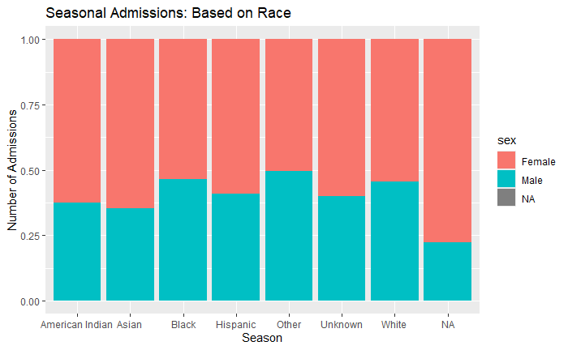{width="60%"}
The graph shows the distribution of seasonal admissions by race, with different colors representing gender. It shows the proportion of admissions for each race across different seasons, using a stacked bar chart where the fill represents gender.

## Graph 2
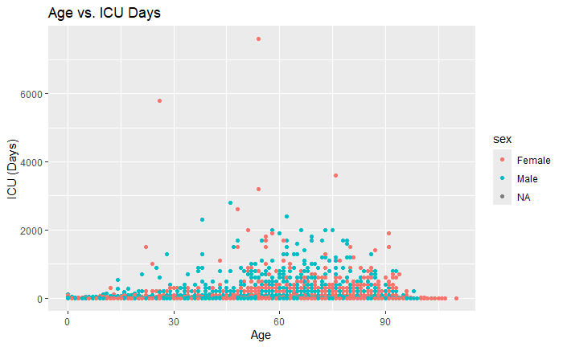{width="60%"}
The graph shows the relationship between age and ICU days, with individual points representing data points for each patient. The points are colored by sex, allowing for a comparison of ICU days across different ages and genders.

## Graph 3

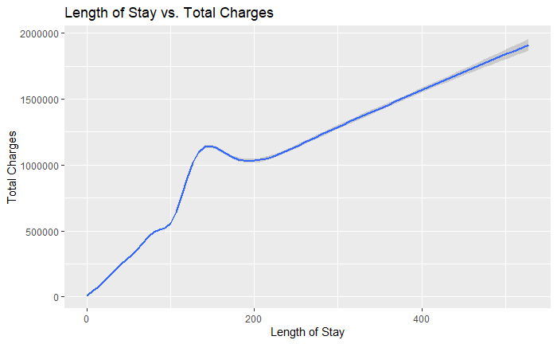{width="60%"}
The graph illustrates the relationship between the length of stay (LOS) and total charges, with a smoothed line showing the trend. It highlights how total charges change as the length of stay increases, based on the data.

## Graph 4
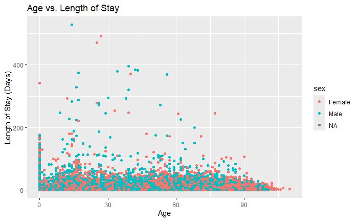{width="60%"}
The graph shows the relationship between age and length of stay (LOS), with individual data points representing patients. The points are color-coded by sex, allowing for a comparison of LOS across different ages and genders.

## Graph 5
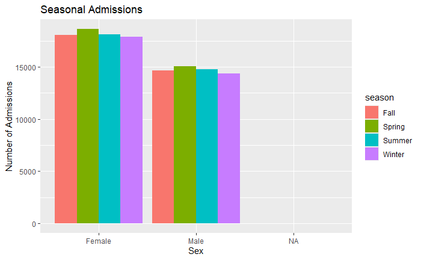{width="60%"}
The graph shows the number of seasonal admissions by sex, with bars grouped by gender and colored by season. It allows for a comparison of admission counts for males and females across different seasons.

## Graph 6
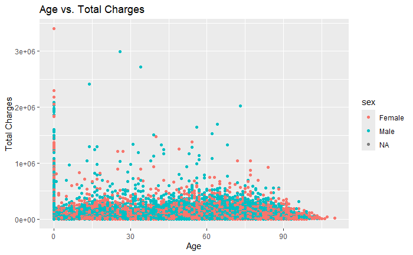{width="60%"}
The graph shows the relationship between age and total charges, with individual data points representing patients. The points are color-coded by sex, allowing for a comparison of total charges across different ages and genders.

## Graph 7
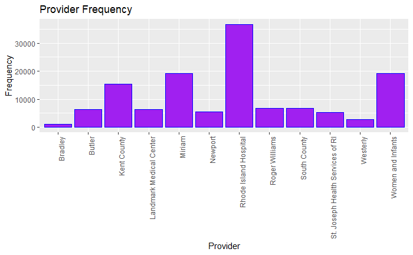{width="60%"}
The graph displays the frequency of different providers, with bars representing the count for each provider. The x-axis labels are rotated for better readability, and the bars are filled with purple and outlined in blue.

## Graph 8
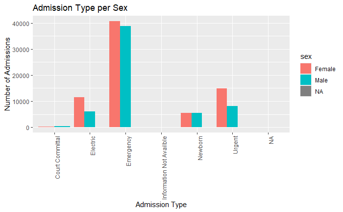{width="60%"}
The graph shows the number of admissions by admission type, with bars grouped by sex and colored accordingly. The x-axis labels are rotated, allowing for a comparison of admission types across different genders.

## Graph 9
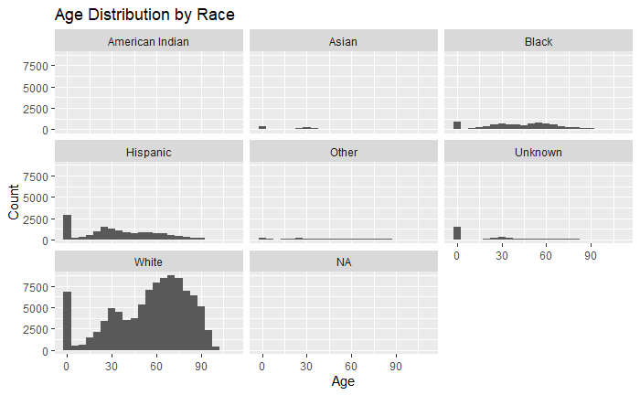{width="60%"}
The graph shows the distribution of age across different races, with histograms for each race displayed in separate panels. The x-axis represents age (grouped in 5-year bins), while the y-axis shows the count of individuals in each age group.

## Graph 10
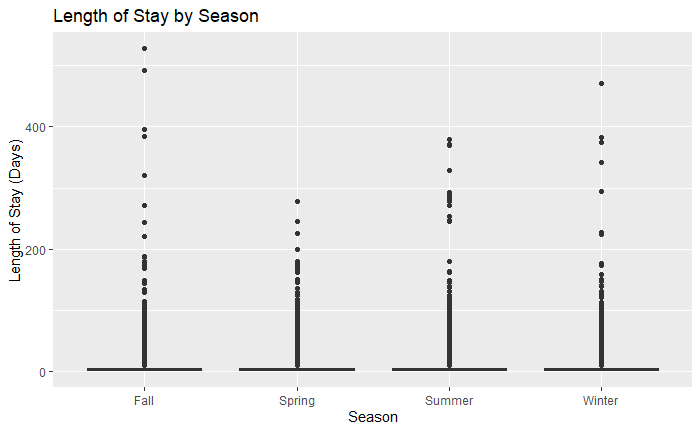{width="60%"}
The graph shows the distribution of length of stay (LOS) across different seasons, with a boxplot illustrating the range, median, and interquartile range of LOS for each season. The boxes are filled with purple, highlighting variations in LOS between seasons.

## Animation Graph
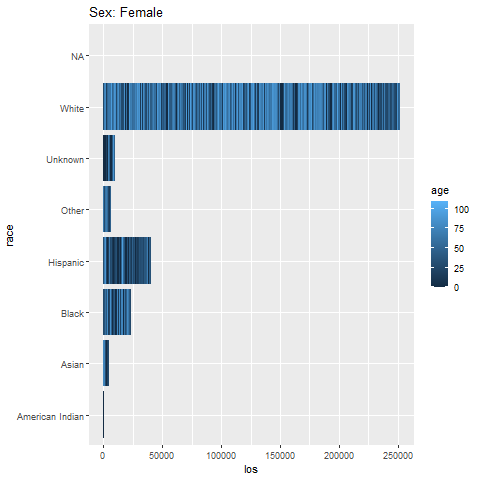{width="60%"}

## Accuracy Graph
{width="60%"}
This graph shows accuracy

## Tree Graph
{width="60%"}

## Bar Graph
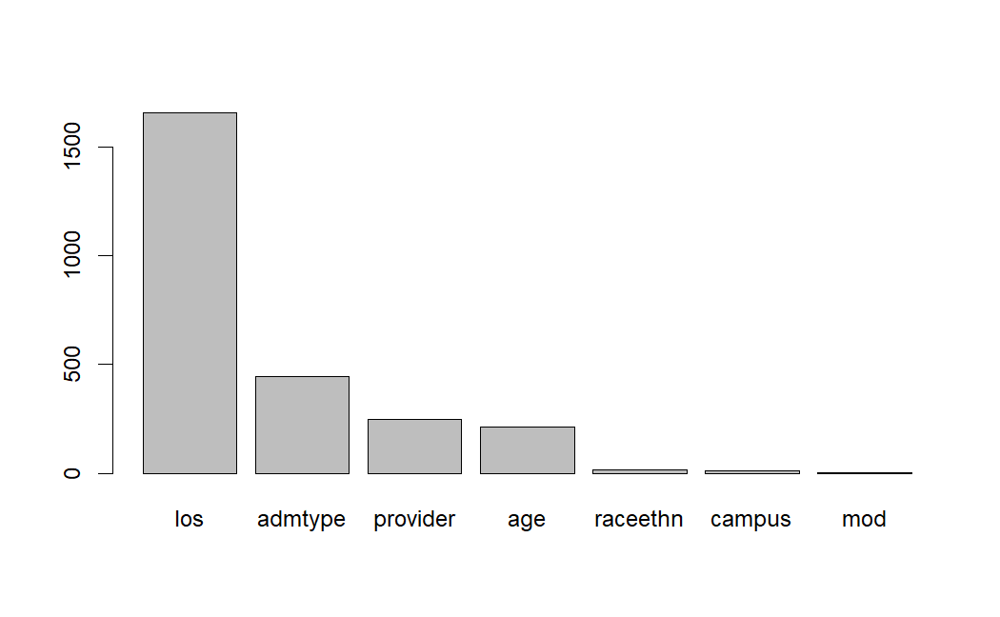{width="60%"}

## Age Graph
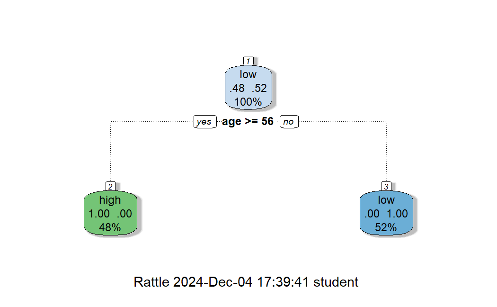{width="60%"}

## Age Graph
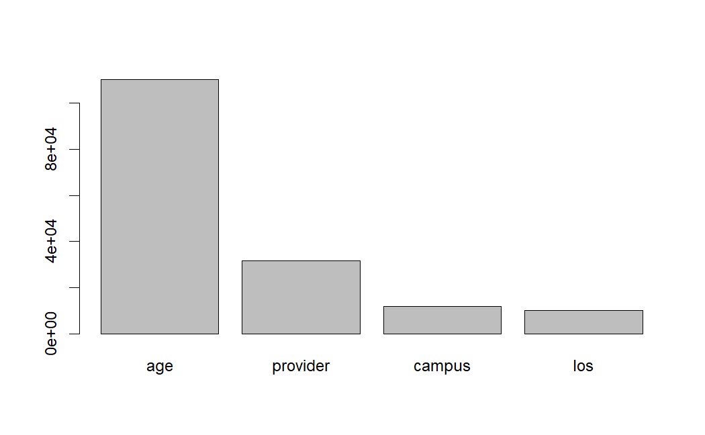{width="60%"}

## The most challenging part was the size of the file and finding relevant variables.

